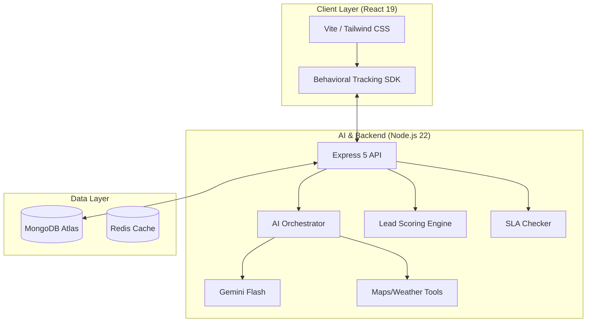

# 🏡 EstatePulse AI: Next-Gen Real Estate Intelligence

> **Transforming property transactions through AI-driven lead scoring, smart search, and automated seller accountability.**

[](https://deepmind.google/technologies/gemini/)
[](https://www.mongodb.com/)

---

## 🌟 The Vision

EstatePulse AI solves the two biggest pain points in real estate: **Lead Qualification** and **Seller Responsiveness**. By leveraging **Google Gemini** and **LangChain**, we've built a platform that scores intent and holds stakeholders accountable through a behavioral analysis engine.

---

## 🚀 Key Features

### 1. 🔥 Intelligent Lead Scoring (0-100)
Calculates a real-time **Intent Score** based on multi-dimensional behavioral analysis:
- **Engagement**: Scroll depth, view time, repeat visits, and image views.
- **AI Interaction**: Depth and quality of questions asked to the AI Agent.
- **Direct Action**: Property saves, likes, and direct seller contact.

### 2. 🤖 AI Orchestration (LangChain + Gemini)
- **Natural Language Search**: Context-aware queries (e.g., *"4BHK villa under 5Cr near Indiranagar"*).
- **Specialized AI Tools**: Integrated location analysis (Google Maps) and climate data (OpenWeather).
- **Automated Q&A**: Instant answers curated from seller-provided documents and brochures.

### 3. ⚖️ Seller Accountability (SLA)
- **Dynamic Deadlines**: SLAs adjust based on lead heat and seller workload.
- **Escalation Pipeline**: Failure to respond triggers listing hiding, rating drops, and eventual account suspension.

---

## 🗺️ System Architecture



---

## 📡 Core API Reference

| Endpoint | Method | Description |
| :--- | :--- | :--- |
| `/api/v1/properties/parse-pdf` | `POST` | AI context extraction from PDF brochures. |
| `/api/v1/search/properties` | `POST` | Smart natural language property search. |
| `/api/v1/leads/track/view/:id` | `POST` | Log property engagement for scoring. |
| `/api/v1/leads/track/ai` | `POST` | Log AI interactions for intent analysis. |
| `/api/v1/leads/lead/:id/respond` | `PATCH` | Mark SLA compliance. |

---

## 🚦 Getting Started

### Prerequisites
- **Node.js**: v22.x | **MongoDB**: v6.0+
- **API Keys**: Google Gemini, OpenWeather, Google Maps.

### Setup & Launch
```bash
# Clone & Install
git clone https://github.com/praneeth-7606/HACKTHON_TWO.git && cd HACKTHON_TWO
cd Server && npm install && cd ../Client && npm install

# Configure Environment (Server/.env)
# PORT, MONGODB_URI, JWT_SECRET, GEMINI_API_KEY, OPENWEATHER_API_KEY, EMAIL_USER, EMAIL_PASS

# Start Application
# Terminal 1: Server
cd Server && npm run dev
# Terminal 2: Client
cd Client && npm run dev
```

---

<p align="center">Made with ❤️ for the AI Hackathon.</p>
