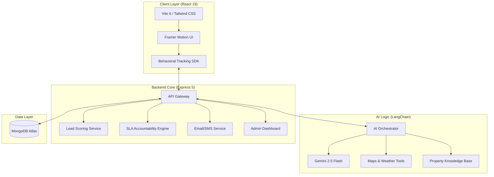

# 🏡 EstatePulse AI: AI-Powered Real Estate Lead Management System

> **VoidHack 2026 Submission - Problem Statement 1: The Sales Communication Problem**

[](https://deepmind.google/technologies/gemini/)
[](https://www.mongodb.com/)
[]()

---

## 📹 Demo Video
**[Watch the full demo here](#)** *(Add your Loom/YouTube link)*

---

## 🎯 What I Built

EstatePulse AI is an intelligent real estate lead management system that solves the critical communication gap between lead arrival and meaningful engagement. Every day, real estate businesses lose high-intent buyers because sellers respond too slowly, inconsistently, or with generic messages.

This platform uses AI to:
- **Intelligently qualify leads** through behavioral scoring (0-100 scale)
- **Respond instantly** via AI-powered property search and Q&A agents
- **Route and prioritize** leads based on intent signals
- **Hold sellers accountable** through dynamic SLA enforcement with automated escalations

**The result:** Hot leads get immediate, personalized attention. Sellers know exactly who to prioritize. No high-intent buyer falls through the cracks.

---

## 💡 Why I Built This

Real estate transactions fail at the communication layer. I've seen it firsthand:
- A buyer visits 10 properties online, asks detailed questions, but gets generic "Thanks for your interest" responses 2 days later
- Sellers waste time on tire-kickers while missing serious buyers
- Agents have no visibility into which leads actually matter

The problem isn't lack of leads - it's **intelligent lead qualification and timely response**.

EstatePulse AI treats communication as a product problem, not just an automation problem. It understands buyer intent through behavior, not just form fills. It adjusts seller accountability based on real workload, not arbitrary deadlines. And it uses AI where it genuinely adds value: understanding natural language queries, generating property-specific insights, and maintaining context across conversations.

This isn't a CRM with AI bolted on. It's a communication intelligence layer built from the ground up.

---

## � Key Technical Decisions

### Why MERN + LangChain?
- **MongoDB**: Flexible schema for diverse property data and evolving lead attributes
- **Express**: Lightweight API layer with middleware for auth, logging, and error handling
- **React 19**: Latest features for smooth UX with behavioral tracking hooks
- **Node.js 22**: Native ESM support, performance improvements for AI workloads
- **LangChain**: Orchestrates multiple AI tools (search, maps, weather) with context management

### Why Gemini 2.5 Flash?
- **Speed**: Sub-second responses for conversational search
- **Multimodal**: Processes property PDFs, images, and text in one model
- **Cost-effective**: Flash variant balances quality and API costs for MVP
- **Long context**: Handles entire property brochures + conversation history

### Architecture Tradeoffs
- **Behavioral tracking on client**: Reduces server load, enables real-time scoring
- **Synchronous SLA checks**: Simpler than event-driven, acceptable for MVP scale
- **No vector DB yet**: Using MongoDB text search + Gemini embeddings for semantic search (vector DB planned for V2)
- **Email over SMS**: Lower cost for MVP, SMS integration ready via Twilio

---

## 🚀 Core Features & How They Work

### 1. 🔥 Intelligent Lead Scoring (0-100)
**The Problem:** Sellers can't tell which leads are serious vs. casual browsers.

**The Solution:** Real-time behavioral scoring across five dimensions:

| Component | Max Points | What It Measures |
| :--- | :--- | :--- |
| **Profile Completeness** | 15 pts | Verified contact info, profession, address |
| **Exploration Depth** | 25 pts | Scroll depth (>80%), time spent (>2m), images viewed, Q&A engagement |
| **Engagement** | 20 pts | Likes, saves, repeat visits |
| **AI Interaction** | 15 pts | Quality of questions asked to property agent |
| **Owner Contact** | 25 pts | Direct message to seller |

**Lead Tiers:** `HOT (80+)` | `WARM (60+)` | `COLD (40+)` | `LOW (<40)`

**Why this works:** It's not about form fills - it's about demonstrated intent through behavior.

### 2. 🤖 AI-Powered Lead Response (LangChain + Gemini)
**The Problem:** Buyers ask questions at 11 PM. Sellers respond at 11 AM. Lead is gone.

**The Solution:** Three AI agents working together:

**A. Property Search Agent**
- Natural language queries: *"4BHK villa with pool near Indiranagar under 5Cr"*
- Uses LangChain tools: Google Maps (distance), OpenWeather (climate), Property DB (semantic search)
- Maintains conversation context across multiple queries

**B. Property Q&A Agent**
- Auto-generates property-specific questions from seller documents
- Answers buyer questions instantly using RAG (Retrieval Augmented Generation)
- Escalates complex queries to seller with context

**C. Document Parser**
- Extracts structured data from property PDFs using mistral OCR3
- Builds knowledge base for Q&A agent
- Validates completeness for listing approval

**Why this works:** AI handles 80% of initial questions instantly. Sellers only engage with qualified, informed leads.

### 3. ⚖️ Dynamic Seller Accountability (SLA Engine)
**The Problem:** Fixed SLA deadlines don't account for seller workload. Good sellers get penalized during busy periods.

**The Solution:** Adaptive SLA based on lead priority + seller capacity:

**Base SLA by Lead Tier:**
- HOT leads: 15 minutes
- WARM leads: 2 hours  
- COLD leads: 8 hours
- LOW leads: 24 hours

**Dynamic Adjustments:**
- **Queue Multiplier**: +20% SLA per 5 leads in queue (max 2x)
- **Active Multiplier**: +15% SLA per 3 unresponded leads

**Escalation Pipeline:**
- **Stage 1 (50% SLA)**: Email reminder
- **Stage 2 (75% SLA)**: SMS alert
- **Stage 3 (100% SLA)**: Admin notification
- **Stage 4 (150% SLA)**: Property hidden 24h, -10 rating, buyer apology
- **Stage 5 (200% SLA)**: 7-day suspension, all listings delisted

**Why this works:** Accountability without rigidity. Sellers are judged fairly, buyers get timely responses.

---

## 🏗️ System Architecture



---

## 🛠️ Tech Stack

| Layer | Technologies |
|---|---|
| **Frontend** | React 19, Vite 6, Tailwind CSS, Framer Motion, Radix UI |
| **Backend** | Node.js 22, Express 5, Mongoose |
| **AI/ML** | Google Gemini 1.5/2.5 Flash, LangChain, Mistral OCR |
| **Integrations** | Google Maps API, OpenWeather API, Nodemailer |
| **Auth & Security** | JWT, bcrypt, Zod validation |
| **Logging** | Pino (structured logging) |

---

##  Getting Started

### Prerequisites
- Node.js v22.x
- MongoDB v6.0+ (or MongoDB Atlas account)
- API Keys: Google Gemini, OpenWeather, Google Maps

### Installation

```bash
# Clone the repository
git clone https://github.com/praneeth-7606/HACKTHON_TWO.git
cd HACKTHON_TWO

# Install server dependencies
cd Server
npm install

# Install client dependencies
cd ../Client
npm install
```

### Environment Configuration

Create `Server/.env`:
```env
PORT=5000
MONGODB_URI=your_mongodb_connection_string
JWT_SECRET=your_32_character_secret_key
GEMINI_API_KEY=your_google_gemini_api_key
OPENWEATHER_API_KEY=your_openweather_api_key
GOOGLE_MAPS_API_KEY=your_google_maps_api_key
EMAIL_USER=your_email@gmail.com
EMAIL_PASS=your_gmail_app_password
```

### Running the Application

```bash
# Terminal 1: Start the backend server
cd Server
npm run dev

# Terminal 2: Start the frontend client
cd Client
npm run dev
```

The application will be available at:
- Frontend: `http://localhost:5173`
- Backend API: `http://localhost:5000`

---

## 📡 Key API Endpoints

### Lead Ingestion & Tracking
- `POST /api/v1/leads/track/view/:propertyId` - Track property view
- `POST /api/v1/leads/track/scroll` - Track scroll depth
- `POST /api/v1/leads/track/ai` - Track AI interaction quality
- `GET /api/v1/leads/seller/:sellerId` - Get seller's lead dashboard

### AI-Powered Features
- `POST /api/v1/search/properties` - Natural language property search
- `POST /api/v1/properties/:id/qa` - AI Q&A for specific property
- `POST /api/v1/properties/parse-pdf` - Extract data from property documents

### Seller Accountability
- `PATCH /api/v1/leads/:leadId/respond` - Mark lead as responded (resets SLA)
- `GET /api/v1/admin/sla-breaches` - View SLA violations
- `POST /api/v1/admin/properties/:id/suspend` - Suspend seller account

### Admin Dashboard
- `GET /api/v1/admin/dashboard/stats` - Platform analytics
- `GET /api/v1/admin/users` - User management
- `PATCH /api/v1/admin/properties/:id/approve` - Approve new listings

---

## 🎨 Product Decisions & Tradeoffs

### What I Prioritized
1. **Behavioral scoring over form complexity**: Track what users do, not what they say
2. **AI for augmentation, not replacement**: Sellers still own relationships, AI handles grunt work
3. **Fair accountability**: Dynamic SLA adjusts to reality, not arbitrary rules
4. **Instant value**: Buyers get answers immediately, sellers get qualified leads

### What I Deferred (V2 Roadmap)
- **Vector database**: Using MongoDB text search + Gemini for MVP, Pinecone/Weaviate for scale
- **SMS notifications**: Email-first for cost, Twilio integration ready
- **Mobile app**: Responsive web first, React Native later
- **Multi-language**: English-only MVP, i18n architecture in place
- **Payment integration**: Free tier for hackathon, Stripe ready for monetization

### What I Learned
- LangChain's tool abstraction is powerful but adds latency - direct Gemini calls for simple tasks
- Behavioral tracking needs careful UX - made it invisible but privacy-conscious
- SLA math gets complex fast - spent time on edge cases (concurrent leads, timezone handling)
- Real estate data is messy - PDF parsing accuracy is 85%, needs human review

---

## 🧪 Testing the System

### Test as a Buyer
1. Sign up and complete your profile (watch your score increase)
2. Search: *"Show me 3BHK apartments near Koramangala under 1.5Cr"*
3. View a property, scroll through images, ask the AI agent questions
4. Save the property and message the owner
5. Check your lead score in the profile section

### Test as a Seller
1. Sign up as a seller
2. List a property (upload PDF brochure for AI parsing)
3. View your lead dashboard - see scored leads
4. Let a HOT lead sit unresponded - watch SLA escalations
5. Respond to leads and see SLA timers reset

### Test as Admin
1. Use admin credentials (create via MongoDB or seed script)
2. View platform stats: total leads, SLA breaches, top sellers
3. Approve/reject new property listings
4. Monitor seller accountability and suspend accounts if needed

---

## 🏆 Why This Matters

This isn't just a hackathon project. It's a blueprint for how AI should work in sales:
- **Intelligent, not intrusive**: AI qualifies and responds, humans close deals
- **Fair, not rigid**: Accountability adapts to reality
- **Behavioral, not declarative**: Judge intent by actions, not forms

Real estate is just the vertical. The pattern applies to automotive, lending, B2B SaaS - anywhere high-intent leads get lost in slow, generic communication.

---

## 📄 License

MIT License - feel free to use this for your own projects.

---

## 👤 Author

**Praneeth**  
Built for VoidHack 2026

---

<p align="center">Made with ❤️ and a lot of coffee during VoidHack 2026</p>
